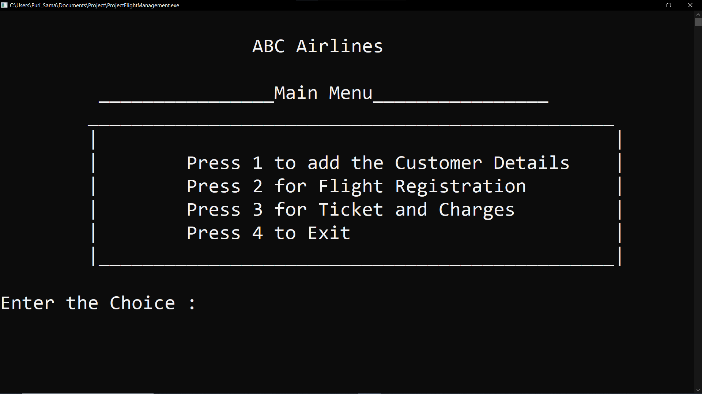
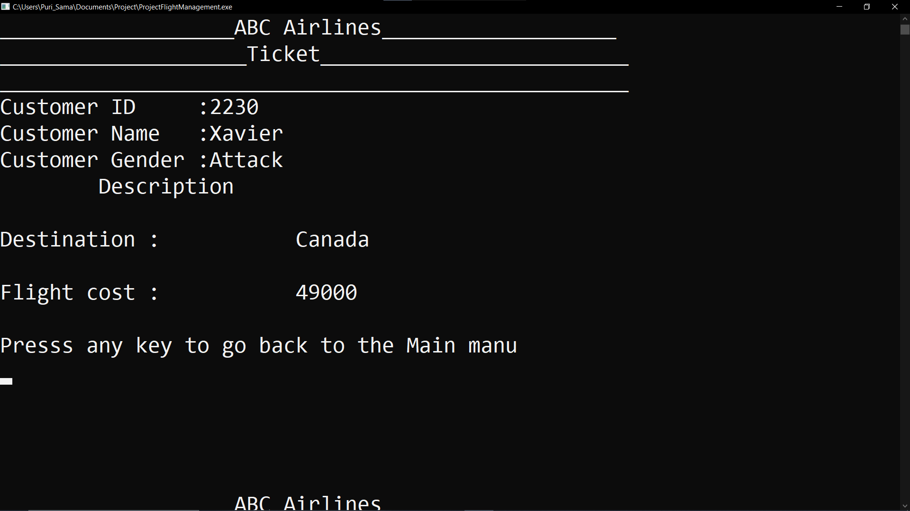

<h1 align="center">Flight-Management-and-Ticket-Booking-System</h1>

## Table of Contents

- [About](#about)
- [How to Run](#how-to-run)
- [Screenshots](#screenshots)
  - [Landing page](#landing-page)
  - [Demo page for final output](#demo-page-for-final-output)
- [Contact](#contact)

## About
- It is my first small project based on C++. I named it "Flight-Management-and-Ticket-Booking-System".
- Flight Booking System without any unecessay complicated functions.

## How to Run
  - Install any compatitable compiler in your system.
    - [CodeBlocks Page](https://www.codeblocks.org/downloads/).
  - Clone the project from my repository.
    - For the Cloning repository, follow the [GitHub Page](https://github.com/Samiul191139/Flight-Management-and-Ticket-Booking-System)
  - Run the project and enjoy.

## Screenshots
  ### Landing page

  ### Demo page for final output

## Contact
- GitHub [@Samiul191139](https://github.com/Samiul191139)
